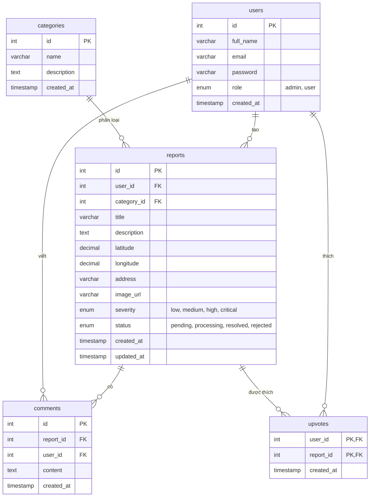

# Sơ đồ Cơ Sở Dữ Liệu (ERD) - WarningInfo

Dưới đây là sơ đồ quan hệ thực thể (ERD) cho hệ thống báo cáo sự cố môi trường.

## Các bảng chính:
1. **users:** Lưu thông tin người dùng và phân quyền (role admin/user).
2. **categories:** Lưu các danh mục ô nhiễm (Rác thải, Khói bụi, Nước...).
3. **reports:** Bảng quan trọng nhất, lưu chi tiết một báo cáo sự cố kèm tọa độ (latitude, longitude) và hình ảnh.
4. **comments:** Bình luận của người dùng về một sự cố.
5. **upvotes:** Lưu lượt "Tôi cũng thấy vấn đề này" (Upvote) của cộng đồng.
